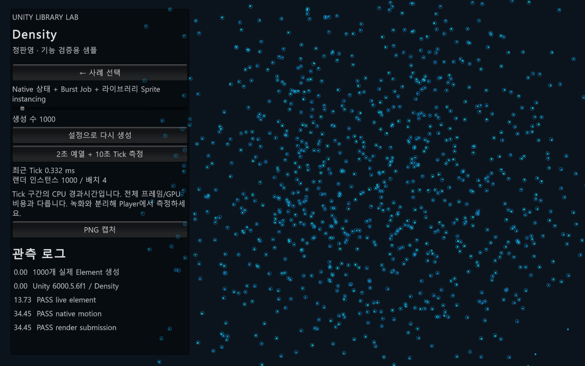

# PanHighDensityElement — 다수 2D 요소를 데이터와 Job으로 갱신

## 1. 사용 목적

요소마다 GameObject를 두지 않고 다수의 2D 요소를 이동·질의·표시하는 런타임입니다.

## 2. 사용 예

```csharp
// 초기화된 world와 컴파일된 archetype이 필요합니다.
var builder = ElementSpawnBuilder.From(archetype)
    .WithPose(new float2(0, 0), new float2(1, 1))
    .WithVelocity(new float2(1, 0));
var result = world.Spawn(builder);
// 소유자의 고정 갱신 경계에서 호출
world.Tick(fixedDeltaTime);
```

설정과 의존성이 준비된 호출 형태를 설명하는 예시입니다. 새 Unity 샘플에서 이 API 흐름의 생성·갱신·표시를 검증했습니다.

## 3. 핵심 설계

요소 상태 배열 → lane별 이동 Job 예약 → 의존 Job 완료 → 물리 질의·동기화 → 결과와 표시

ElementMotionJob은 Burst와 IJobParallelFor, NativeContainer를 사용합니다. Tick은 kinematic/area/physics lane의 이동 작업을 예약하고 finally에서 결합된 작업의 완료를 보장합니다. Physics Core 2D world와 bodyless 질의, 특수 물리 lane을 구분합니다. WorldId·Slot·Generation 식별자는 재사용된 슬롯과 이전 참조를 구별합니다. 핵심 패키지와 PanEvent 연동·기존 Physics2D bridge·PanTan은 별도 패키지입니다.

## 4. 선택 이유와 한계

핵심 데이터 갱신을 게임별 이벤트나 대상 Transform 수명에서 분리한 구조입니다. Job 완료 대기·질의·렌더링 비용은 남으며 Burst를 사용했다는 사실이 성능 우위를 증명하지 않습니다. 아래에 별도 Windows Player 측정 조건과 결과를 기록했습니다. PanHighDensityProjectile은 구형 호환 패키지이므로 신규 시연의 기본 API로 삼지 않습니다.

## 5. 본인 기여

본인 개발 라이브러리입니다. 최초 요구 정의, 해당 구조를 선택한 이유, 직접 구현·검증한 부분과 AI 지원 범위는 사용자 확인 후 확정합니다. 현재 설명은 코드로 확인한 동작입니다.

## 6. 검증 근거와 읽을 코드

- [Runtime/ElementJobs.cs](../Libraries/PanHighDensityElement/Runtime/ElementJobs.cs)
- [Runtime/ElementWorld.Tick.cs](../Libraries/PanHighDensityElement/Runtime/ElementWorld.Tick.cs)
- [Runtime/ElementWorld.SpawnLifecycle.cs](../Libraries/PanHighDensityElement/Runtime/ElementWorld.SpawnLifecycle.cs)
- [Runtime/ElementArchetype.cs](../Libraries/PanHighDensityElement/Runtime/ElementArchetype.cs)

[시연 명세](demo-specs.md#density) · [테스트 파일 목록](inventory.md)

새 샘플의 Unity Editor 실행에서 1,000개 요소 생성·이동·렌더 제출 검사를 통과했습니다. 아래는 Codex가 제작한 기능 검증용 촬영 초안이며 기존 게임의 성능 개선 결과가 아닙니다. 화면의 Tick 시간은 편집기 관측값이고 별도 Player 성능 결과는 아래에 구분했습니다. 정식 로컬 의존성을 설치한 별도 폴더에서도 새 빌드와 실행 검사를 통과했습니다.

[시연 코드](../UnityDemo/Assets/Portfolio/Runtime/PortfolioDemo.cs) · [무음 MP4 초안](Media/Density-draft.mp4) · [자동 검사 결과](Media/Density-verification.json)



## Windows Development Player 측정

Ryzen 7 5800X / RTX 3080 Ti, Unity 6000.5.6f1, Direct3D 12에서 녹화 없이 3회 실행했습니다. 원본 프로젝트의 성능 검증 코드를 내용 변경 없이 사용했습니다. 각 실행은 요소 5,000개, 대상 256개, 이벤트 호스트 1,000개, 5초 예열 후 30초 측정 조건입니다. 화면이 표시되는 일반 Player에서 1440×900을 요청했으며 실제 framebuffer 크기는 보고서가 수집하지 않았습니다.

| 실행 | 평균 프레임 ms | 95백분위 ms | 검증 결과 |
| --- | ---: | ---: | --- |
| 1 | 7.462 | 11.936 | 통과 |
| 2 | 7.848 | 12.452 | 통과 |
| 3 | 7.019 | 10.700 | 통과 |

요소 처리의 측정 구간에서는 프레임별 할당 최대 0 bytes를 기록했습니다. **전체 프레임에서는 GC 할당이 관측됐습니다.** FrameTimingManager의 GPU 프레임 시간 평균은 실행 순서대로 0.058 ms, 0.058 ms, 0.056 ms였습니다. GPU 시간은 CPU 처리 구간과 별도의 관측값입니다. 비교 구현과의 우위나 모든 장비에서의 성능을 보장하는 결과가 아닙니다.

[측정 원자료](Media/density-player-measurements.json) · [실행한 검증 코드](../UnityDemo/Assets/Portfolio/Validation/HighDensityElementPerformanceValidation.cs)

Windows Development Player에서도 실제 창을 표시한 상태로 자동 검사를 통과했습니다.

[Player 캡처](Media/Density-player.png) · [Player 검사 결과](Media/Density-player-verification.json)
