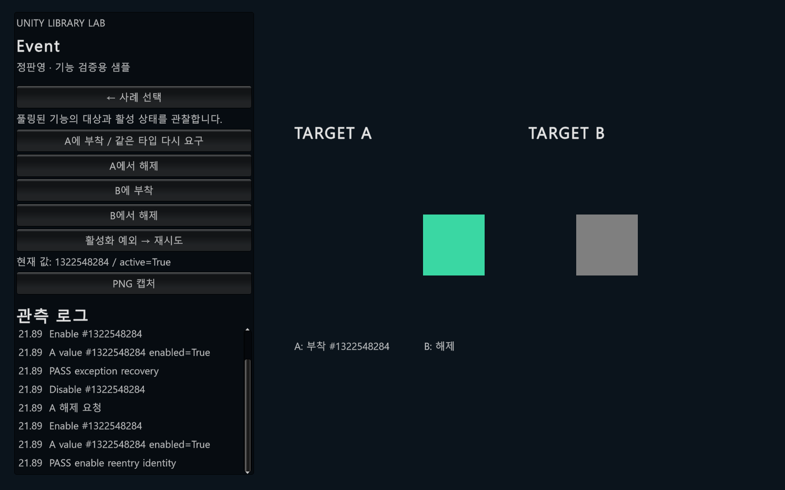

# PanEventManager — 재사용하는 기능의 부착과 수명 관리

## 1. 사용 목적

게임 대상에 기능을 부착하고 활성화·해제한 뒤 풀에서 재사용할 때 소유 대상과 잔여 상태를 관리합니다. 일반적인 메시지 발행·구독 버스와 역할이 다릅니다.

## 2. 사용 예

```csharp
// 프로젝트에서 정의한 DemoEventValue와 초기화된 EventAble이 필요합니다.
// DemoEventValue는 Require의 제네릭 제약을 충족해야 합니다.
var feature = eventAble.Require<DemoEventValue>();
```

설정과 의존성이 준비된 호출 형태를 설명하는 예시입니다. 아래 실행 근거에서 새 Unity 샘플의 실제 호출·검증 범위를 확인할 수 있습니다.

## 3. 핵심 설계

기존 테이블 조회 → 풀에서 값 확보 → 테이블 예약 → 활성화 → 소유 상태 검증

RequireInternal은 기존 부착값을 먼저 확인합니다. 새 값은 활성화 콜백 전에 테이블에 예약해 같은 타입의 재진입이 같은 인스턴스를 찾게 합니다. 활성화 후에도 테이블이 같은 인스턴스를 소유하는지 검사합니다. 예외 시 자신이 보유한 예약을 제거할 수 있을 때 풀에 반환하고 예외를 전파합니다. 풀과 대상의 테이블은 서로 다른 수명을 가집니다.

## 4. 선택 이유와 한계

활성화 콜백의 재진입과 제거를 고려한 소유권 확인이 핵심입니다. 풀링만 도입하면 해결되는 문제가 아닙니다. 기능 구현자는 Disable/Reset 경로에서 구독과 대상 참조를 정리해야 하며, 제네릭 제약과 라이프사이클 학습 비용이 있습니다. 최초 선택 이유와 직접 작성 범위는 확인 중입니다.

## 5. 본인 기여

본인 개발 라이브러리입니다. 최초 요구 정의, 해당 구조를 선택한 이유, 직접 구현·검증한 부분과 AI 지원 범위는 사용자 확인 후 확정합니다. 현재 설명은 코드로 확인한 동작입니다.

## 6. 검증 근거와 읽을 코드

- [Scripts/PanEventAble.Mutation.cs](../Libraries/PanEventManager/Scripts/PanEventAble.Mutation.cs)
- [Scripts/PanEventValueManager.cs](../Libraries/PanEventManager/Scripts/PanEventValueManager.cs)

[시연 명세](demo-specs.md#event) · [테스트 파일 목록](inventory.md)

새 Unity 샘플에서 같은 타입 재요구, 해제·재사용, 활성화 예외 복구와 재진입 검사를 통과했습니다. 이는 Codex가 제작한 시연 코드의 실행 결과이며 기존 게임의 개발 성과와 구분합니다. 공개본의 독립 설치 검증과 직접 기여 범위 확정은 남아 있습니다.


[시연 코드](../UnityDemo/Assets/Portfolio/Runtime/PortfolioDemo.cs) · [무음 MP4 초안](Media/Event-draft.mp4) · [검사 결과](Media/Event-verification.json)



Windows Development Player에서도 실제 창을 표시한 상태로 자동 검사를 통과했습니다.

[Player 캡처](Media/Event-player.png) · [Player 검사 결과](Media/Event-player-verification.json)
