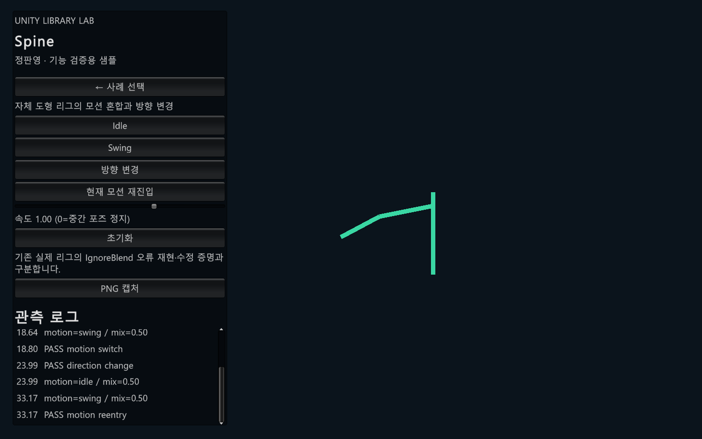

# PanSpinePackage — 모션 전환 중 방향과 이산 정책의 처리

## 1. 사용 목적

Spine의 일반 모션 보간을 유지하면서 전환 중 방향 변경과 Plane·반전 같은 이산 정책의 적용을 관리합니다.

## 2. 사용 예

```csharp
// 원본 제약조건 이름에 (IGNORE_BLEND) 태그를 지정하고 다시 export합니다.
// SkelObject.CurrentDB 연결 후 기존 SkelObject.Ani 경로로 재생합니다.
// AnimationIgnoreBlendManager를 임의로 중복 생성하지 않습니다.
```

설정과 의존성이 준비된 호출 형태를 설명하는 예시입니다. 아래 실행 근거에서 새 Unity 샘플의 실제 호출·검증 범위를 확인할 수 있습니다.

## 3. 핵심 설계

정책 Timeline 분리 → 일반 모션 native Mix → 이전·현재 정책 평가 → 캐릭터별 전환 보정

AnimationIgnoreBlendManager는 태그된 제약조건에 연결된 정책 Timeline을 메모리에서 분리합니다. 종료 포즈와 정책을 보관하며 방향이 바뀌면 이전과 현재 정책을 각각 새 방향에서 평가합니다. 공유 정책 프로필과 캐릭터별 포즈·버퍼 수명을 분리합니다. 같은 트랙 교체와 시간 배율 처리는 SkelObject의 AniCore 경로가 담당합니다.

## 4. 선택 이유와 한계

특정 Run/Idle 이름에 예외를 붙이지 않고 태그와 정책 그래프를 계약으로 사용합니다. 모든 임의 리그의 연속성을 보장하는 범용 IK 해법은 아니며, 특이행렬·상충 입력 등에는 경고와 정책 적용 fallback이 있습니다. 최초 생성 setup의 장거리 회전까지 해결했다고 확대하지 않습니다.

## 5. 본인 기여

사용자가 문제 증상·기대 동작·일반화 조건을 제시하고 AI와 수정한 후 직접 확인한 대화 기록이 있습니다. 코드 작성과 설계별 구체적인 역할 분담은 추가 확인 중입니다.

## 6. 검증 근거와 읽을 코드

- [Scripts/SkelSbject/SkelSbject_pBoxes.cs](../Libraries/PanSpinePackage/Scripts/SkelSbject/SkelSbject_pBoxes.cs)
- [Scripts/SkelObject/SkelObject_pCoreAni.cs](../Libraries/PanSpinePackage/Scripts/SkelObject/SkelObject_pCoreAni.cs)
- [Tests/Editor/AnimationIgnoreBlendManagerTests.cs](../Libraries/PanSpinePackage/Tests/Editor/AnimationIgnoreBlendManagerTests.cs)

[시연 명세](demo-specs.md#spine) · [테스트 파일 목록](inventory.md)

새 Unity 샘플에서 자체 최소 리그의 초기화, 모션 전환, 방향 변경, 재진입 검사를 통과했습니다. 이는 Codex가 제작한 시연 코드의 실행 결과이며 기존 게임의 개발 성과와 구분합니다. 공개본의 독립 설치 검증과 직접 기여 범위 확정은 남아 있습니다.


[시연 코드](../UnityDemo/Assets/Portfolio/Runtime/PortfolioDemo.cs) · [무음 MP4 초안](Media/Spine-draft.mp4) · [검사 결과](Media/Spine-verification.json)



이 최소 리그는 기존 IgnoreBlend 정책 보정 오류를 재현하지 않습니다. 일반 전환 시연으로만 해석합니다.

Windows Development Player에서도 실제 창을 표시한 상태로 자동 검사를 통과했습니다.

[Player 캡처](Media/Spine-player.png) · [Player 검사 결과](Media/Spine-player-verification.json)
