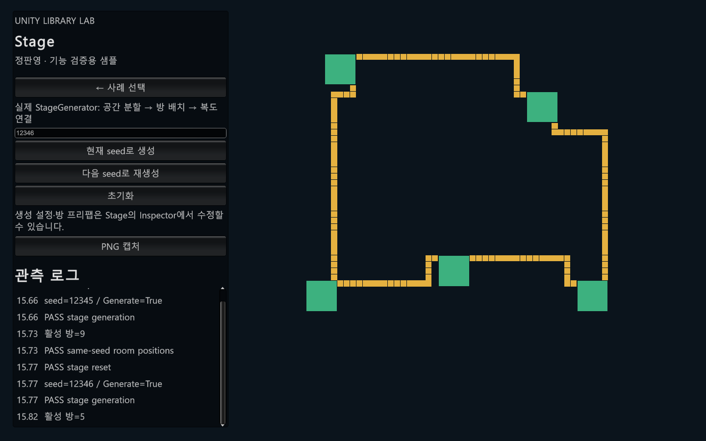

# PanStageGenerator2 — 설정으로 방과 복도를 생성하는 시스템

## 1. 사용 목적

반복 제작하는 맵에서 방의 배치, 공간 간 연결, 실제 복도 경로를 단계별로 구성합니다.

## 2. 사용 예

```csharp
// 설정과 방 리소스가 연결된 GenerateManager를 전달합니다.
// 호출 예시이며 독립 실행 샘플이 아닙니다.
bool succeeded = await generateManager.GenerateAsync(customSeed: 12345);
```

설정과 의존성이 준비된 호출 형태를 설명하는 예시입니다. 아래 실행 근거에서 새 Unity 샘플의 실제 호출·검증 범위를 확인할 수 있습니다.

## 3. 핵심 설계

GenerateAsync → 공간 생성 → 공간 연결 선택 → 복도 경로 탐색 → 배치 결과 적용

공간 연결은 후보 간선의 비용을 정렬하고 Union-Find로 순환 여부를 판정하는 최소 신장 트리 구조입니다. 복도의 실제 이동 경로는 비용과 휴리스틱, IndexedPriorityQueue를 사용하는 A*로 구합니다. 방 배치 좌표 이동 일부는 Burst와 IJobParallelForTransform에 맡기며 예약한 작업의 완료와 NativeArray 해제를 관리합니다.

## 4. 선택 이유와 한계

연결 관계와 통로 형상을 분리하면 각각의 규칙을 설명하고 수정하기 쉽습니다. 이는 구현에서 해석한 장점이며 최초 개발 동기는 확인 중입니다. MST만으로 게임의 재미나 모든 배치의 유효성이 보장되지는 않으며, A*도 탐색 경계와 금지 영역 설정에 영향을 받습니다. 비동기 진입점이 모든 계산의 병렬 실행을 뜻하지는 않습니다.

## 5. 본인 기여

본인 개발 라이브러리입니다. 최초 요구 정의, 해당 구조를 선택한 이유, 직접 구현·검증한 부분과 AI 지원 범위는 사용자 확인 후 확정합니다. 현재 설명은 코드로 확인한 동작입니다.

## 6. 검증 근거와 읽을 코드

- [StageGenerator/StageGenerator_pGenerateManager.cs](../Libraries/PanStageGenerator2/StageGenerator/StageGenerator_pGenerateManager.cs)
- [StageGenerator/StageGenerator_pSpaceManager.cs](../Libraries/PanStageGenerator2/StageGenerator/StageGenerator_pSpaceManager.cs)
- [StageGenerator/StageGenerator_pPlaceManager_pGen.cs](../Libraries/PanStageGenerator2/StageGenerator/StageGenerator_pPlaceManager_pGen.cs)
- [StageGenerator/StageGenerator_pPlaceManager.cs](../Libraries/PanStageGenerator2/StageGenerator/StageGenerator_pPlaceManager.cs)

[시연 명세](demo-specs.md#stage) · [테스트 파일 목록](inventory.md)

새 Unity 샘플에서 동일 seed의 방 위치 재현, 초기화, 다른 seed 생성 검사를 통과했습니다. 이는 Codex가 제작한 시연 코드의 실행 결과이며 기존 게임의 개발 성과와 구분합니다. 공개본의 독립 설치 검증과 직접 기여 범위 확정은 남아 있습니다.


[시연 코드](../UnityDemo/Assets/Portfolio/Runtime/PortfolioDemo.cs) · [무음 MP4 초안](Media/Stage-draft.mp4) · [검사 결과](Media/Stage-verification.json)



Windows Development Player에서도 실제 창을 표시한 상태로 자동 검사를 통과했습니다.

[Player 캡처](Media/Stage-player.png) · [Player 검사 결과](Media/Stage-player-verification.json)
